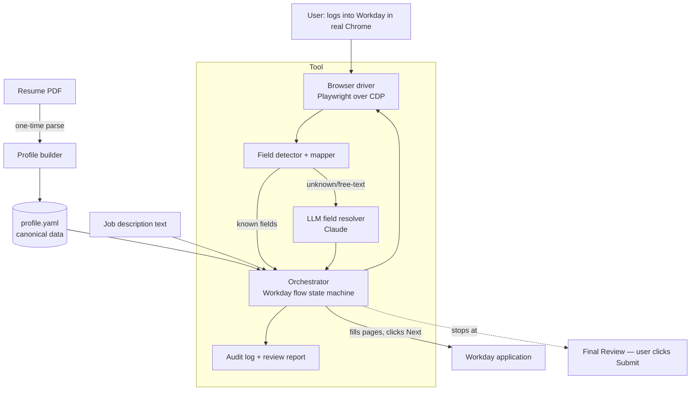

# Workday Autofill — Design Doc

> Status: **SETTLED v1** (workflow phase 2 complete). All major decisions resolved; living doc — update as decisions change.

## Problem & goals

Applying to jobs on Workday is miserable: every employer runs its own Workday tenant
(`company.wdN.myworkdayjobs.com`), forces account creation, and makes you re-type your
entire resume into clunky multi-page forms — even though you just uploaded the PDF.

**Goal:** a tool that drives the user's real, logged-in Chrome, walks through a Workday
application end-to-end, fills *every* field it can from a canonical profile (resume +
LLM for free-text), and **stops at the final Submit** so the user does one quick review
and clicks Submit themselves.

Success = for a typical Workday application, the user goes from "blank form" to "ready to
submit, everything correct" with near-zero typing, and trusts the result enough to submit.

## Non-goals / out of scope

- ❌ Fully autonomous submit (explicitly rejected — see Autonomy decision). 🟢
- ❌ Mass / bulk auto-applying to hundreds of jobs (bot-flag + quality risk, and not the need).
- ❌ Scraping/aggregating job listings, or other ATSes (Greenhouse, Lever, iCIMS) — Workday only for v1.
- ⚠️ Email-verification automation (we do NOT read your inbox; you click the verify link).
- ❌ Defeating CAPTCHAs or bot-detection. We *avoid* detection by using the real browser, not beating it.

## Requirements & constraints

- **R1** Drive the user's *real* Chrome with their existing logins/cookies. 🟢
- **R2** Fill, navigate multi-page Workday wizard, **pause before final Submit**. 🟢
- **R3** Canonical profile data in one editable file (`profile.yaml`), seeded from resume PDF. 🟢
- **R4** Use an LLM (Claude) to answer free-text / employer-specific screening questions from
  profile + job description, with **low-confidence answers flagged**, never silently guessed. 🟢
- **R5** Never auto-answer legally/strategically sensitive fields (work authorization, visa
  sponsorship, criminal history, EEO/veteran/disability) without explicit user-set values.
- **R6** Robust to per-tenant field variation — map by semantics (labels/aria), not fixed selectors.
- **R7** Full audit log of what was filled + confidence, so the user can review fast.
- **C1** macOS, Python venv (per project rules). No global installs.
- **C2** Respect Workday ToS-ish reality: human-in-the-loop, real browser, no aggressive scraping.

## Proposed architecture

**Component responsibilities** (each earns its place):

- **Browser driver (Playwright `connect_over_cdp`)** — *why:* connecting over the Chrome
  DevTools Protocol to a Chrome the user launched with `--remote-debugging-port` reuses
  their real profile/cookies/logins and looks like a human session (R1, avoids bot flags).
- **Field detector + mapper** — *why:* enumerates each page's inputs and classifies them by
  label/aria/autocomplete/placeholder into profile keys. Workday's custom dropdowns/date
  pickers aren't native `<select>`, so this needs Workday-aware widget handling (R6).
- **LLM field resolver (Claude)** — *why:* free-text and screening questions can't be a
  lookup table; needs reasoning over profile + JD. Returns answer + confidence; flags
  low-confidence and sensitive fields instead of guessing (R4, R5).
- **Orchestrator / flow state machine** — *why:* Workday is a fixed wizard (My Information →
  My Experience → Application Questions → Voluntary Disclosures → Self-Identify → Review).
  Drives page-by-page, fills, clicks Save & Continue, halts at Review (R2).
- **Profile store + builder** — *why:* single source of truth, version-controllable; resume
  parse seeds it once, user edits/corrects (R3).
- **Audit log + review report** — *why:* user must verify fast before submitting; logs every
  field, source (profile/LLM), and confidence (R7).

## Stack choice + why

- **Python 3.12 + Playwright** — fastest LLM-adjacent automation stack; Playwright's
  `connect_over_cdp` is the clean path to drive real Chrome. 🟢
- **Anthropic SDK (Claude Sonnet 4.6, `claude-sonnet-4-6`)** for the field resolver — fast
  and cheap, strong enough for form answers. 🟢
- **PyYAML** for profile; **resume parsing = LLM-drafted** (extract PDF text, hand to Claude
  to draft `profile.yaml`, user corrects). 🟢
- **Rich/CLI** for the review report. Prototype is a CLI script, not a GUI.

## Alternatives considered + why rejected

- **Headless Playwright with its own profile** — rejected: re-login per tenant, far more
  bot-flagging, can't reuse the user's session. (You chose real Chrome.)
- **Chrome extension** — viable, lowest detection, but much more frontend work; revisit for v2.
- **Full auto-submit** — rejected: wrong screening/EEO answers, blacklist risk, no human check.
- **Hardcoded per-tenant selectors** — rejected: brittle, breaks across tenants and Workday updates.

## Account creation (optional step, per tenant)

Each company is a separate Workday tenant → a separate account. The tool fills the
"Create Account" form using one **reusable password** from `profile.yaml.credentials`
(gitignored), then **pauses before the final Create click** and for the **email
verification link** (we never read your inbox). Created tenants are recorded in
`accounts.yaml`; re-runs fill the **Sign In** form instead of duplicating. Email
verification stays manual on purpose — automating it means inbox access (bigger
permission/security surface) and signup is the most bot-scrutinized moment.

For companies where an account already exists with a different (old) password,
`profile.yaml.credentials.tenant_overrides` maps the Workday hostname → that old
password; `signup` uses it for Sign In, and the default reusable password for new
accounts. **Feature request (backlog):** automate the email reset/verify link via the
Gmail connector — would reverse the "manual verification" stance in exchange for inbox
read access.

## Phone control (v2, future)

The fill engine must run on the Mac (Playwright + desktop Chrome — no mobile runtime).
But the phone can act as a **remote trigger + approver**: the Mac runs the tool, pushes
a notification when the application is filled and **paused at Review**, and the phone shows
what was filled and offers an **Approve & Submit** button. Likely impl: a small local
service (push via ntfy.sh / Telegram bot) exposing an approve link. **Phone approves, then
submits — never blind auto-submit** (keeps the human check, just moved to the phone).
Constraint: Mac must be awake with the debug Chrome running. Deferred until the core
fill engine works.

## Failure modes / risks

- **Custom Workday widgets** (typeahead dropdowns, date pickers, multiselect) don't fill like
  native inputs → mapper needs widget-specific handlers; prototype must hit a real one early.
- **Bot detection / Cloudflare** despite real browser → keep human-paced, no parallelism, real profile.
- **LLM hallucinating answers** to screening questions → confidence gating + sensitive-field blocklist (R5).
- **Tenant layout drift** breaking the flow state machine → semantic mapping + graceful "I couldn't
  fill X, do it manually" rather than crashing.
- **Resume parse garbage** → profile.yaml is hand-correctable; parse is a seed, not authority.
- **Multi-page state loss / session timeout** → save progress, allow resume mid-application.

## Rollout / deploy plan

1. **Prototype (disposable):** CLI that connects to real Chrome on one *known* Workday job,
   fills the "My Information" page from `profile.yaml`, prints a per-field review table, and
   offers a **per-field correction loop** (pick a field → re-enter value → it refills just that
   one in the browser; repeat, then stop). Answers the riskiest question: *can we reliably
   drive real Chrome + fill Workday's custom widgets, and correct any single field?*
2. Add remaining wizard pages + LLM resolver + audit report.
3. Test against 3–4 real tenants (different companies) to prove R6 (tenant robustness).
4. Harden into product: error handling, resume-mid-app, packaging, light test suite + CI.

## Settled decisions (resolved from open questions)

1. ✅ **LLM model:** Claude Sonnet 4.6 (`claude-sonnet-4-6`).
2. ✅ **Resume parsing:** LLM-drafted from extracted PDF text → user corrects.
3. ✅ **Prototype target:** a real live Workday job URL the user provides.
4. ✅ **Sensitive fields blocklist** (work auth, visa sponsorship, criminal history,
   EEO/veteran/disability) — *always* user-set in `profile.yaml`, never LLM-guessed.
5. ✅ **Job description:** scraped from the Workday job posting page, with paste-text fallback.
