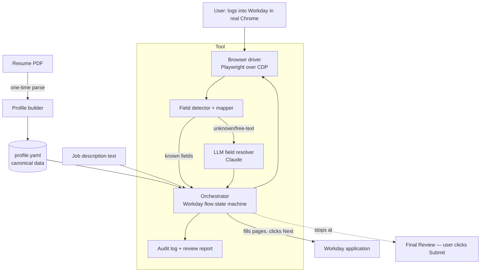
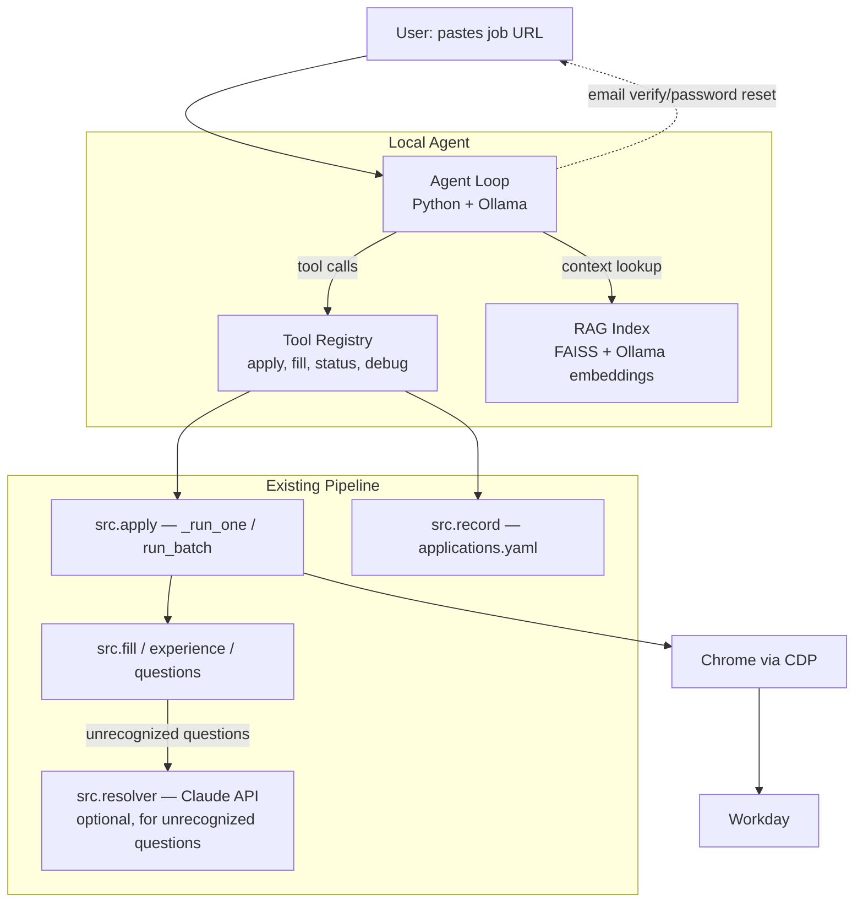

# Workday Autofill — Design Doc

> Status: **SETTLED v1** (workflow phase 2 complete). All major decisions resolved; living doc — update as decisions change.

## Problem & goals

Applying to jobs on Workday is miserable: every employer runs its own Workday tenant
(`company.wdN.myworkdayjobs.com`), forces account creation, and makes you re-type your
entire resume into clunky multi-page forms — even though you just uploaded the PDF.

**Goal:** a tool that drives the user's real, logged-in Chrome, walks through a Workday
application end-to-end, fills *every* field it can from a canonical profile (resume +
LLM for free-text), and **stops at the final Submit** so the user does one quick review
and clicks Submit themselves.

Success = for a typical Workday application, the user goes from "blank form" to "ready to
submit, everything correct" with near-zero typing, and trusts the result enough to submit.

## Non-goals / out of scope

- ❌ Fully autonomous submit (explicitly rejected — see Autonomy decision). 🟢
- ❌ Mass / bulk auto-applying to hundreds of jobs (bot-flag + quality risk, and not the need).
- ❌ Scraping/aggregating job listings, or other ATSes (Greenhouse, Lever, iCIMS) — Workday only for v1.
- ⚠️ Email-verification automation (we do NOT read your inbox; you click the verify link).
- ❌ Defeating CAPTCHAs or bot-detection. We *avoid* detection by using the real browser, not beating it.

## Requirements & constraints

- **R1** Drive the user's *real* Chrome with their existing logins/cookies. 🟢
- **R2** Fill, navigate multi-page Workday wizard, **pause before final Submit**. 🟢
- **R3** Canonical profile data in one editable file (`profile.yaml`), seeded from resume PDF. 🟢
- **R4** Use an LLM (Claude) to answer free-text / employer-specific screening questions from
  profile + job description, with **low-confidence answers flagged**, never silently guessed. 🟢
- **R5** Never auto-answer legally/strategically sensitive fields (work authorization, visa
  sponsorship, criminal history, EEO/veteran/disability) without explicit user-set values.
- **R6** Robust to per-tenant field variation — map by semantics (labels/aria), not fixed selectors.
- **R7** Full audit log of what was filled + confidence, so the user can review fast.
- **C1** macOS, Python venv (per project rules). No global installs.
- **C2** Respect Workday ToS-ish reality: human-in-the-loop, real browser, no aggressive scraping.

## Proposed architecture



**Component responsibilities** (each earns its place):

- **Browser driver (Playwright `connect_over_cdp`)** — *why:* connecting over the Chrome
  DevTools Protocol to a Chrome the user launched with `--remote-debugging-port` reuses
  their real profile/cookies/logins and looks like a human session (R1, avoids bot flags).
- **Field detector + mapper** — *why:* enumerates each page's inputs and classifies them by
  label/aria/autocomplete/placeholder into profile keys. Workday's custom dropdowns/date
  pickers aren't native `<select>`, so this needs Workday-aware widget handling (R6).
- **LLM field resolver (Claude)** — *why:* free-text and screening questions can't be a
  lookup table; needs reasoning over profile + JD. Returns answer + confidence; flags
  low-confidence and sensitive fields instead of guessing (R4, R5).
- **Orchestrator / flow state machine** — *why:* Workday is a fixed wizard (My Information →
  My Experience → Application Questions → Voluntary Disclosures → Self-Identify → Review).
  Drives page-by-page, fills, clicks Save & Continue, halts at Review (R2).
- **Profile store + builder** — *why:* single source of truth, version-controllable; resume
  parse seeds it once, user edits/corrects (R3).
- **Audit log + review report** — *why:* user must verify fast before submitting; logs every
  field, source (profile/LLM), and confidence (R7).

## Stack choice + why

- **Python 3.12 + Playwright** — fastest LLM-adjacent automation stack; Playwright's
  `connect_over_cdp` is the clean path to drive real Chrome. 🟢
- **Anthropic SDK (Claude Sonnet 4.6, `claude-sonnet-4-6`)** for the field resolver — fast
  and cheap, strong enough for form answers. 🟢
- **PyYAML** for profile; **resume parsing = LLM-drafted** (extract PDF text, hand to Claude
  to draft `profile.yaml`, user corrects). 🟢
- **Rich/CLI** for the review report. Prototype is a CLI script, not a GUI.

## Alternatives considered + why rejected

- **Headless Playwright with its own profile** — rejected: re-login per tenant, far more
  bot-flagging, can't reuse the user's session. (You chose real Chrome.)
- **Chrome extension** — viable, lowest detection, but much more frontend work; revisit for v2.
- **Full auto-submit** — rejected: wrong screening/EEO answers, blacklist risk, no human check.
- **Hardcoded per-tenant selectors** — rejected: brittle, breaks across tenants and Workday updates.

## Account creation (optional step, per tenant)

Each company is a separate Workday tenant → a separate account. The tool fills the
"Create Account" form using one **reusable password** from `profile.yaml.credentials`
(gitignored), then **pauses before the final Create click** and for the **email
verification link** (we never read your inbox). Created tenants are recorded in
`accounts.yaml`; re-runs fill the **Sign In** form instead of duplicating. Email
verification stays manual on purpose — automating it means inbox access (bigger
permission/security surface) and signup is the most bot-scrutinized moment.

For companies where an account already exists with a different (old) password,
`profile.yaml.credentials.tenant_overrides` maps the Workday hostname → that old
password; `signup` uses it for Sign In, and the default reusable password for new
accounts. **Feature request (backlog):** automate the email reset/verify link via the
Gmail connector — would reverse the "manual verification" stance in exchange for inbox
read access.

## Phone control (v2, future)

The fill engine must run on the Mac (Playwright + desktop Chrome — no mobile runtime).
But the phone can act as a **remote trigger + approver**: the Mac runs the tool, pushes
a notification when the application is filled and **paused at Review**, and the phone shows
what was filled and offers an **Approve & Submit** button. Likely impl: a small local
service (push via ntfy.sh / Telegram bot) exposing an approve link. **Phone approves, then
submits — never blind auto-submit** (keeps the human check, just moved to the phone).
Constraint: Mac must be awake with the debug Chrome running. Deferred until the core
fill engine works.

## Failure modes / risks

- **Custom Workday widgets** (typeahead dropdowns, date pickers, multiselect) don't fill like
  native inputs → mapper needs widget-specific handlers; prototype must hit a real one early.
- **Bot detection / Cloudflare** despite real browser → keep human-paced, no parallelism, real profile.
- **LLM hallucinating answers** to screening questions → confidence gating + sensitive-field blocklist (R5).
- **Tenant layout drift** breaking the flow state machine → semantic mapping + graceful "I couldn't
  fill X, do it manually" rather than crashing.
- **Resume parse garbage** → profile.yaml is hand-correctable; parse is a seed, not authority.
- **Multi-page state loss / session timeout** → save progress, allow resume mid-application.

## Rollout / deploy plan

1. **Prototype (disposable):** CLI that connects to real Chrome on one *known* Workday job,
   fills the "My Information" page from `profile.yaml`, prints a per-field review table, and
   offers a **per-field correction loop** (pick a field → re-enter value → it refills just that
   one in the browser; repeat, then stop). Answers the riskiest question: *can we reliably
   drive real Chrome + fill Workday's custom widgets, and correct any single field?*
2. Add remaining wizard pages + LLM resolver + audit report.
3. Test against 3–4 real tenants (different companies) to prove R6 (tenant robustness).
4. Harden into product: error handling, resume-mid-app, packaging, light test suite + CI.

---

## v2: Local Agent (Open-Source LLM Orchestrator)

> Status: **DESIGN IN PROGRESS**

### Problem & goals

Running the pipeline through Claude Code works but burns ~70% API usage for 7 jobs because
the *orchestration* (read errors, decide next step, debug) runs through Claude's context
window. The actual automation code is 95% rule-based — only ~5% needs an LLM (the question
resolver). We need a local agent that can orchestrate the pipeline for free.

**Goal:** A local agent powered by an open-source model (via Ollama) that can:
1. Accept job URLs and run the apply pipeline end-to-end
2. Handle errors/blockers by reading output and deciding next steps
3. Answer "what does X do" questions about the codebase via RAG
4. Fall back to Claude API only for the question resolver (configurable)
5. Pause for human input on email verification and password resets (never automated)

**Success =** user types a job URL into a local CLI, the agent runs the full pipeline
without any paid API calls (except optional resolver), and handles common errors
(missing fields, page detection failures) autonomously.

### Non-goals

- ❌ Replacing Claude resolver entirely (keep as option, add Ollama alternative)
- ❌ Email/password automation by the agent (security risk — stays human-in-the-loop)
- ❌ Building a GUI or web interface (CLI-first)
- ❌ Fine-tuning a model on Workday forms (tool-use + RAG is sufficient)

### Architecture



### Components

**1. Agent Loop (`src/agent/loop.py`)**

A simple Python loop:
```
while True:
    user_input or tool_result → build messages
    send to Ollama (with tools + system prompt)
    parse response → text or tool_call
    if tool_call: execute, feed result back
    if text: print to user
    if done: break
```

No framework (no LangChain). Just `requests` to Ollama's `/api/chat` endpoint
with tool-use format. Keeps it debuggable and dependency-light.

**2. Tool Registry (`src/agent/tools.py`)**

Thin wrappers around existing pipeline functions. Each tool has a name, description,
parameters (JSON schema), and an execute function. The agent sees tool descriptions
and decides which to call.

Proposed tools:

| Tool | Description | Wraps |
|------|-------------|-------|
| `apply_to_job` | Apply to a single job URL (fill + submit) | `src.apply.main(url, auto_submit=True)` |
| `apply_batch` | Apply to multiple job URLs | `src.apply.run_batch(urls)` |
| `fill_current_page` | Fill whatever page is open in Chrome | `src.apply._run_one(page)` |
| `check_page` | Detect current page type and list fields | `discover_page + discover_fields` |
| `list_applications` | Show submitted applications | `src.record._load()` |
| `check_required` | List required-but-empty fields | `_check_required_fields` |
| `click_next` | Click Next/Save & Continue | `_click_next` |
| `run_signup` | Create account or sign in | `create_or_sign_in` |
| `search_codebase` | RAG search for codebase context | vector search |

**3. RAG Index (`src/agent/rag.py`)**

What to index (small corpus — ~50 chunks):
- `CLAUDE.md` — project rules, critical constraints
- `DESIGN.md` — architecture understanding
- Widget patterns from memory — the 52 hard-won patterns
- Module docstrings from all `src/*.py` files
- `profile.yaml.example` — field reference

Implementation:
- **Embedding model:** Ollama's `nomic-embed-text` (768-dim, fast, local)
- **Vector store:** FAISS (via `faiss-cpu`) or plain numpy cosine similarity
  (corpus is tiny, no need for a real DB)
- **Chunking:** Split by section headers (##), ~500 tokens per chunk
- **Retrieval:** Top-3 chunks injected into system prompt when agent needs context

Index is built once at startup, rebuilt on file changes. Stored as a pickle/npz file.

**4. System Prompt**

The agent's system prompt contains:
- Role: "You are a Workday job application assistant"
- Available tools (auto-injected by the loop)
- Key rules: never auto-submit without user confirmation, email/password is human-only,
  check required fields before Next, fill optional sections too
- Profile summary (name, target roles, key skills — not credentials)
- Recent application history (last 5 from applications.yaml)

RAG chunks are appended when the agent calls `search_codebase` or when an error
occurs that needs debugging context.

### Model choice / agent backends

Two agent backends, user picks via config:

**1. Ollama (free, local)**
- Model: `llama3.1:8b` — good tool-use, runs on M-series Mac at ~30 tok/s
- Alternative: `qwen2.5:7b` — slightly better structured output
- Cost: $0. Runs entirely local.
- Tradeoff: May struggle with complex error debugging. Upgrade to 70B if needed.

**2. Claude API (cheap, smart)**
- Model: `claude-sonnet-4-6` via Anthropic SDK with tool-use
- Cost: ~$0.01-0.03 per application (~5-10K tokens per job)
- Tradeoff: Requires API key, but 100x cheaper than Claude Code because
  context is focused (system prompt + tools, no file reads/edits)
- Why cheaper than Claude Code: Claude Code runs on Opus with full conversation
  context (file reads, edits, all debug output). The API agent has a ~3K token
  system prompt, calls tools, gets structured results. Each job is an independent
  short conversation, not an ever-growing context window.

**For the question resolver:** Stays as Claude API by default. Optionally swap to
Ollama (`resolver_backend: claude | ollama`) — but 8B models may not be reliable
enough for nuanced question answering with confidence scores.

### Security model

- **Credentials never in agent context.** The agent calls tools that internally read
  `profile.yaml` — the agent never sees passwords or account emails.
- **Email verification = human-in-the-loop.** When pipeline returns `pending_verify`
  or `pending_reset`, the agent prints a message and waits for user input.
- **No shell access.** The agent can only call registered tools, not arbitrary commands.
- **Tool results are sanitized.** Strip any credential-like values before returning
  to the model.

### Config

```yaml
# agent_config.yaml
agent_backend: ollama  # ollama | claude
ollama_model: llama3.1:8b
ollama_host: http://localhost:11434
claude_model: claude-sonnet-4-6  # for claude agent backend
resolver_backend: claude  # claude | ollama (question resolver, independent of agent)
resolver_model: llama3.1:70b  # only if resolver_backend=ollama
auto_submit: true
max_concurrent_jobs: 1
```

### Alternatives considered

- **LangChain agent** — rejected: heavy dependencies, opaque abstractions, harder to debug.
  Our tool set is small and fixed; a custom loop is simpler.
- **Full RAG with ChromaDB/Weaviate** — rejected: corpus is ~50 chunks. FAISS or numpy
  is sufficient. No need for a database server.
- **Fine-tuning on Workday forms** — rejected: tool-use is sufficient, and fine-tuning
  would need training data we don't have. The existing pipeline code handles form filling;
  the model just needs to orchestrate.
- **MCP server** — considered: would let any MCP-compatible client (Claude Desktop, etc.)
  use our tools. Good v2.1 addition but adds complexity for the initial build.

### Rollout plan

1. **Tool registry + agent loop** — get a basic loop working with 3 tools (apply, check_page, list_applications)
2. **RAG index** — index docs, wire up search_codebase tool
3. **Error handling** — agent reads pipeline errors and retries/adjusts
4. **Resolver backend swap** — make resolver.py support Ollama as alternative to Claude
5. **CLI entry point** — `python -m src.agent` starts the interactive agent
6. **Test against 3-4 real jobs** — validate end-to-end without Claude Code

### Open questions

1. Should the agent auto-confirm submit, or always ask the user? (Current: configurable via `auto_submit`)
2. Do we need a web UI eventually, or is CLI sufficient?
3. Should the agent be able to search for jobs (LinkedIn/Indeed scraping), or just fill URLs given to it?

## Settled decisions (resolved from open questions)

1. ✅ **LLM model:** Claude Sonnet 4.6 (`claude-sonnet-4-6`).
2. ✅ **Resume parsing:** LLM-drafted from extracted PDF text → user corrects.
3. ✅ **Prototype target:** a real live Workday job URL the user provides.
4. ✅ **Sensitive fields blocklist** (work auth, visa sponsorship, criminal history,
   EEO/veteran/disability) — *always* user-set in `profile.yaml`, never LLM-guessed.
5. ✅ **Job description:** scraped from the Workday job posting page, with paste-text fallback.
